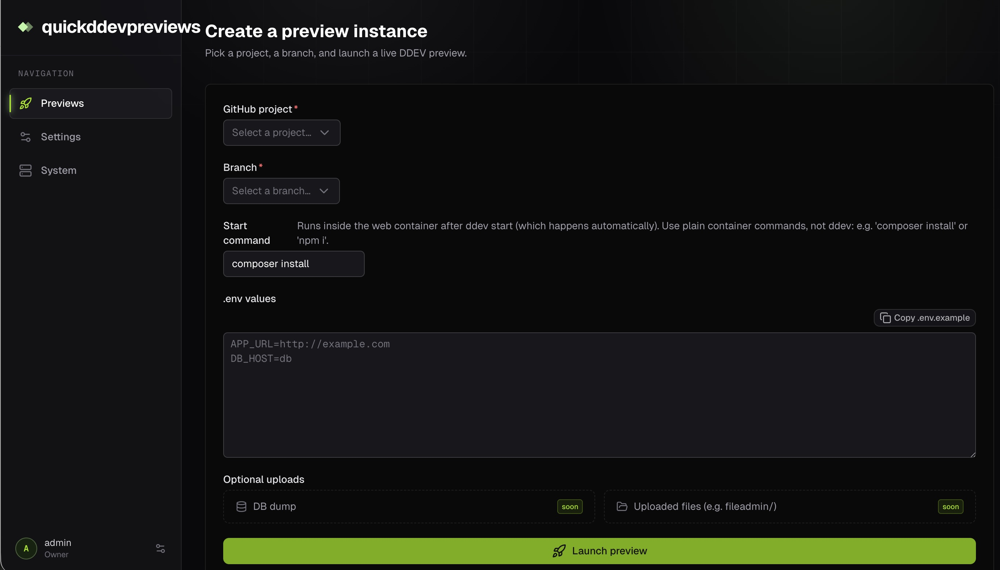
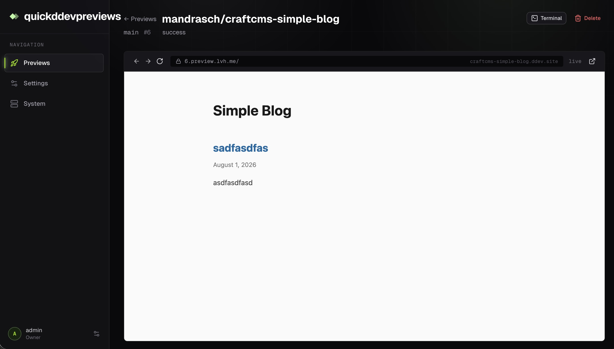
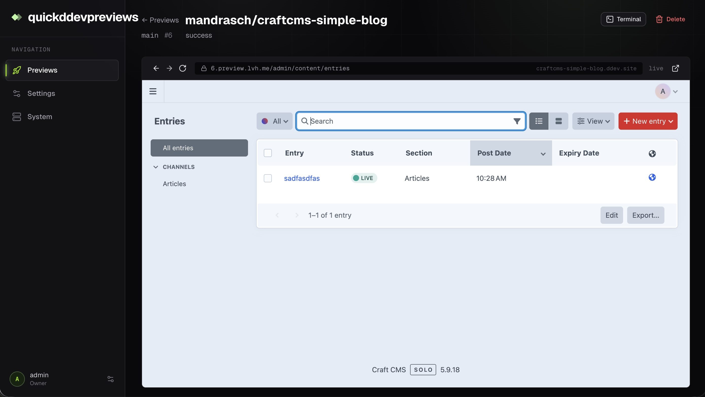
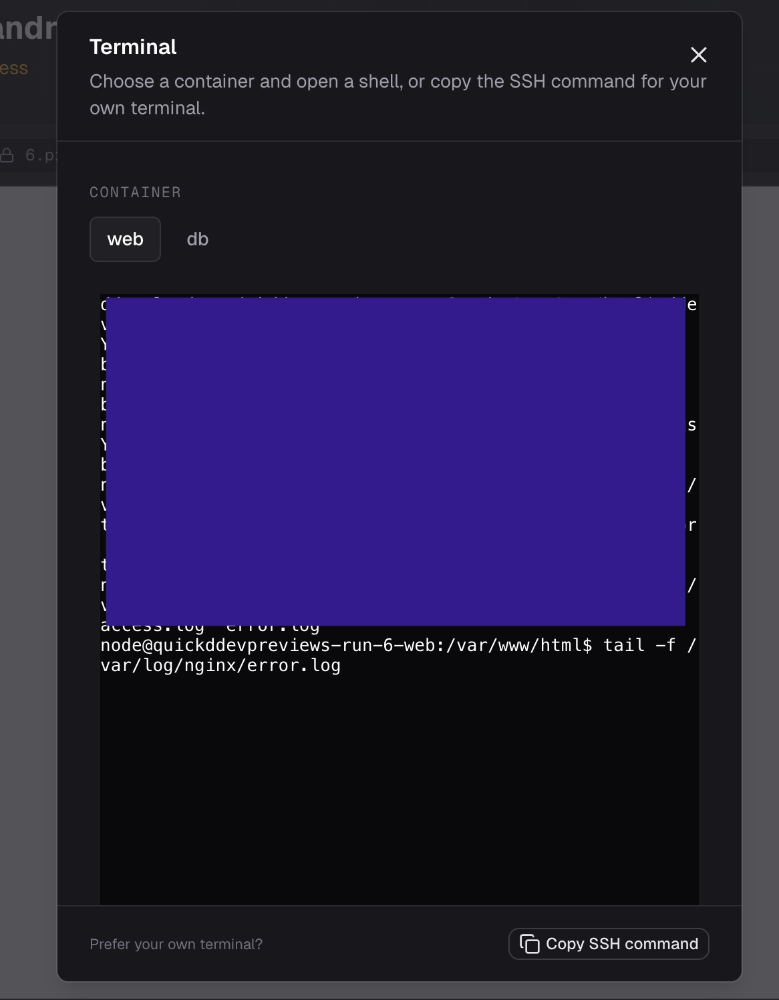

# Quick DDEV previews

A self-hosted service for generating DDEV preview environments. Install it on a Cloud VPS or a MacMini, connect GitHub repositories and launch quick DDEV previews of any branch, which can be shared secretly with testers, clients or coworkers.

## 🚧 (Experimental) fork of Knecht Cloud 🚧

This project is a fork of https://github.com/knecht-works/knecht-cloud, a project made by the amazingly talented Samuel Reichör. 


> [!WARNING]
> Experimental, use at your own risk. Under active development. No warranties given.

## Screenshots

Create preview from any branch:

Example of Craft CMS frontend:

Example of Craft CMS backend:

Jump into the web or db container and run commands like `php craft up`: 


## Install

On a fresh Ubuntu 24.04 server (as root):

```bash
curl -fsSL https://raw.githubusercontent.com/mandrasch/quick-ddev-previews/main/scripts/install.sh | bash
```

The installer asks how the instance should be reached:

```
How do you want to reach this instance?
  1) sslip.io auto-domain (zero DNS; recommended for a VPS) [default]
  2) A real domain you own (e.g. previews.example.com)
  3) lvh.me (local previews on a Mac/Lima VM; internal TLS)
```

- **1** derives `<dashed-ip>.sslip.io` from the server's public IP via
  [sslip.io](https://sslip.io), so no DNS setup is needed. Best for a VPS.
- **2** prompts for your domain; you point DNS records at the box.
- **3** uses `lvh.me` with Caddy's internal CA: all preview subdomains resolve
  to 127.0.0.1, so the whole thing works on one machine with no public access.

It installs Docker, clones the repo, writes `.env`, and starts the app with
Caddy TLS.

> **Image builds from source for now.** No release image is published yet, so
> the installer builds the app image on the server from the cloned checkout
> (`docker compose up -d --build`). A published image (via a GitHub Actions
> release pipeline) is planned for later; see AGENTS.md.

Non-interactive overrides:

```bash
# a real domain, skipping the menu
QDP_DOMAIN=previews.example.com bash <(curl -fsSL <repo-url>/scripts/install.sh)

# force a mode: sslip | domain | lvhme
QDP_MODE=lvhme bash <(curl -fsSL <repo-url>/scripts/install.sh)
```

## Install on macOS (e.g. a Mac mini)

The run substrate (host Docker + ddev) is Linux-only, so on a Mac the same
setup runs inside a [Lima](https://lima-vm.io) VM. Create the VM from the
checked-in template, then run the installer inside it:

```bash
brew install lima
limactl create --name=quickddevpreviews https://raw.githubusercontent.com/mandrasch/quick-ddev-previews/main/scripts/lima-server.yaml
limactl start quickddevpreviews
limactl shell quickddevpreviews
# inside the VM:
curl -fsSL https://raw.githubusercontent.com/mandrasch/quick-ddev-previews/main/scripts/install.sh | sudo bash
```

When the installer asks, choose **3) lvh.me** for local-only previews. lvh.me
resolves to 127.0.0.1, so the dashboard and all preview subdomains reach this
one machine without opening any router ports. The installer swaps in
`Caddyfile.lvhme` (internal CA); accept the certificate warning once in the
browser.

> [!NOTE]
> The Mac must resolve `lvh.me` to 127.0.0.1. If it doesn't (some routers'
> DNS rebinding protection blocks 127.0.0.1 answers, e.g. FritzBox), set the
> Mac's upstream DNS to Google (8.8.8.8) or Cloudflare (1.1.1.1), or add a
> rebind exception for `lvh.me`.

If instead you want the Mac mini publicly reachable, choose mode **1** or **2**
and add the home-network pieces:

1. Forward TCP ports 80 and 443 on your router to the Mac.
2. Point the DNS record at your public IP. Home connections usually change
   their IP over time, so use a dynamic DNS provider (or a static IP from your
   ISP) and give the Mac a fixed address in your router.

After a macOS reboot, run `limactl start quickddevpreviews`; the containers
inside come back up on their own. Updating and backups work exactly as below,
with `/opt/quickddevpreviews` and `/data/quickddevpreviews` living inside the
VM (`limactl shell quickddevpreviews`).

### Switching an existing instance to lvh.me

If the instance was installed in another mode, move it to local previews by
re-running the installer with a clean `.env` (the data in `/data/…` is
untouched):

```bash
limactl shell quickddevpreviews
# inside the VM:
rm /opt/quickddevpreviews/.env
curl -fsSL https://raw.githubusercontent.com/mandrasch/quick-ddev-previews/main/scripts/install.sh | sudo bash
# choose 3) lvh.me
```

> [!NOTE]
> The GitHub App manifest flow needs a publicly reachable callback URL, so
> connecting GitHub won't work in lvh.me mode. Previews themselves work
> locally without it.
>
> GitHub webhooks cannot reach a local instance, so GitHub triggers won't work.

## Development

quickddevpreviews needs a Linux host with Docker and the ddev CLI. For local
development there is a Lima VM that provides exactly that.

### On macOS via the Lima dev VM

```bash
# Install dependencies (on the Mac)
npm install

# Prepare the environment
cp .env.example .env   # adjust the values (see the comments in the file)

# Run database migrations
npm run db:migrate
```

Then create and provision the Linux dev VM (the run substrate, same as a
production VPS), once:

```bash
limactl create --name=quickddevpreviews-dev scripts/lima-vm.yaml
limactl start quickddevpreviews-dev
limactl shell quickddevpreviews-dev -- ./scripts/provision-host.sh
```

`provision-host.sh` installs Docker + the pinned ddev CLI, omits the
ddev-router (it would collide with the preview proxy), and warms the shared
image cache.

Start the dev server inside the VM (edit on the Mac as usual; the repo is
mounted into the VM at the identical path):

```bash
npm run dev:vm
```

Lima auto-forwards the dev server port to the Mac: the UI is at
`http://localhost:3333` and previews at `http://<runId>.preview.lvh.me:3333`
(set `QUICKDDEVPREVIEWS_BASE_DOMAIN=lvh.me` in `.env` first). If `lvh.me`
doesn't resolve, set your Mac's DNS to Google (8.8.8.8) or Cloudflare
(1.1.1.1), or add a rebind exception for `lvh.me`.

> [!NOTE]
> Running project environments requires a Linux host with Docker and ddev.
> Details on host setup live in `.env.example` and the provisioning scripts
> under `scripts/`.

### On a plain Linux host

If you already run Linux, skip Lima:

```bash
npm install
cp .env.example .env
npm run db:migrate
npm run dev
```

For DDEV previews set `QUICKDDEVPREVIEWS_BASE_DOMAIN=lvh.me` in `.env` so the
per-run preview subdomains (`<runId>.preview.lvh.me`) share the session cookie
with the dashboard. Previews need a Linux host with Docker + the ddev CLI
(`scripts/provision-host.sh` installs both; the app image ships ddev too).

## Password reset

If you lose access, run from the server:

```bash
cd /opt/quickddevpreviews
docker compose exec quickddevpreviews npm run reset-password <email>
```

## Tech stack

Nuxt 4 + Nitro, @nuxt/ui, Drizzle ORM + better-sqlite3, nuxt-auth-utils,
Caddy (TLS), Docker Compose.